# Identification of Monetary Policy shocks in South Africa

This Repo serves as the workbook for my Master Thesis. The folder will
also hold all of my figures, tables and data that will be used.

``` r
rm(list = ls()) # Clean your environment:
gc() # garbage collection - It can be useful to call gc after a large object has been removed, as this may prompt R to return memory to the operating system.
```

    ##          used (Mb) gc trigger (Mb) limit (Mb) max used (Mb)
    ## Ncells 486109   26    1038758 55.5         NA   700248 37.4
    ## Vcells 915071    7    8388608 64.0      16384  1963387 15.0

# Libraries

I begin by loading in all the required packages and functions.

``` r
#Loading All requrired packages
if (!require("pacman")) install.packages("pacman")
```

    ## Loading required package: pacman

``` r
pacman::p_load(
  readxl, bsvars, bsvarSIGNs, tseries, readr, dplyr, tidyr,
  ggplot2, lubridate, zoo, extrafont, janitor, stringr, paletteer, jsonlite, 
  vars, kableExtra, knitr, broom, tseries, urca, xtable, readxl
)

# Load fonts and source functions
loadfonts()
source_files <- list.files("code/R/functions", full.names = TRUE)
invisible(sapply(source_files, source))
```

# Load and prepare Data

I then load in the data. GDP is the the year-on year growth rate of real
GDP, the inflation rate is the year-on-year change in the consumer price
index, the commodity index is all individual prices weighted by total
exports, M3 is the year on year change in money supply and lastly
bank_rate is the repo rate set by the South African Reserve bank.

``` r
model_data <- readxl::read_xlsx("data/full_df.xlsx") %>% 
    dplyr::select("gdp_yoy", "inflation",  "commodity", "M3", "bank_rate") %>% 
    tail(-24) %>% 
    dplyr::mutate(across(everything(), ~ as.numeric(as.character(.))))

# Check the structure to confirm changes
str(model_data)
```

    ## tibble [262 × 5] (S3: tbl_df/tbl/data.frame)
    ##  $ gdp_yoy  : num [1:262] 2.64 2.92 3.16 3.43 3.73 ...
    ##  $ inflation: num [1:262] 5.01 5.97 6.32 7.62 7.73 ...
    ##  $ commodity: num [1:262] 43.9 44.2 45.3 45.2 45.4 ...
    ##  $ M3       : num [1:262] 20 20.4 23.1 19.8 18.9 ...
    ##  $ bank_rate: num [1:262] 10.5 10.5 11.5 11.5 11.5 12.5 12.5 12.5 13.5 13.5 ...

# Model selection

Again this will change as I better understand what is going on but for
now I am just bringing in what I know I need and and can use. More
technical stuff can be found in code/R/Dawie/04_bsvar_basic.R

## Model configuration

``` r
# Load Configuration
config <- load_config("code/R/config/config_amend_five.json")
model_params <- config$model_params
plotting_params <- config$plotting
start_date1 <- "2002-01-01"
end_date <- "2023-10-01"
shocks1 <-c("bank_rate")
voi <- c("gdp_yoy", "inflation", "bank_rate")
```

## Access model parameters

``` r
# # Access model parameters
# model_num <- 1 # Not in the config file
# start_date1 <- "2002-01-01"
# end_date <- "2023-10-01"
# voi <- c("gdp_yoy", "inflation", "bank_rate")
# # label_file <- model_params$label_file
# # capital <- model_params$capital_variable
# # gov_spread <- model_params$gov_spread
# # repo <- model_params$repo_rate
# # car_var <- model_params$car_var
```

## Define shocks

``` r
# # Define shocks
# shocks <- define_shocks(model_num, car_var, capital, repo)
```

## Extract data and plot variables

``` r
#Get the data to ts format
data_tbl <- as_tibble(model_data) %>% 
     dplyr::select( "gdp_yoy", "inflation","commodity", "M3",  "bank_rate")

data_mat <- as.matrix(data_tbl)

# Assuming start_date is in the format "YYYY-MM-DD"
start_year1 <- as.numeric(format(as.Date(start_date1), "%Y"))
start_month1 <- as.numeric(format(as.Date(start_date1), "%m"))

# Create the time series
data_ts <- ts(data_mat, start = c(start_year1, start_month1), frequency = 12)


# access custom labels from the ammended json file to be ables to use all of the plotting functions
custom_labels <- get_labels_from_data('/Users/wesleywilliams/Desktop/School/Masters/MThesis/Narrative sign restrictions/Master Thesis/Thesis project/code/R/config/variable_labels_amend.json')
```

``` r
# plot_model_series(data, custom_labels, plotting_params)

plot_model_series(data_ts, custom_labels, plotting_params)
```

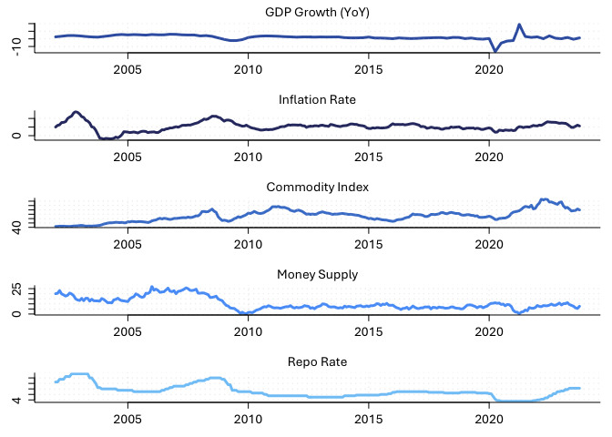 \#
Descriptive stats and tests

## Stationarity tests

This has implications on the prior used.

``` r
# Initialize data frames for storing test results
adf_results <- data.frame(variable = character(), statistic = numeric(), p.value = numeric(), stringsAsFactors = FALSE)
pp_results <- data.frame(variable = character(), statistic = numeric(), p.value = numeric(), stringsAsFactors = FALSE)

# Loop over each numeric column in data_tbl and perform ADF and PP tests
for (col in names(data_tbl)) {
  if (is.numeric(data_tbl[[col]])) {  # Check if the column is numeric
    label <- ifelse(col %in% names(custom_labels), custom_labels[col], col)  # Get custom label or use column name
    
    # Run ADF test and format results
    adf_res <- tidy(adf.test(data_tbl[[col]], alternative = "stationary"))
    adf_res <- adf_res[, c("statistic", "p.value")]  # Select relevant columns
    adf_res$variable <- label  # Add custom label to the results
    adf_results <- rbind(adf_results, adf_res)
    
    # Run PP test and format results
    pp_res <- tidy(pp.test(data_tbl[[col]], alternative = "stationary"))
    pp_res <- pp_res[, c("statistic", "p.value")]  # Select relevant columns
    pp_res$variable <- label  # Add custom label to the results
    pp_results <- rbind(pp_results, pp_res)
  }
}
```

    ## Warning in pp.test(data_tbl[[col]], alternative = "stationary"): p-value
    ## smaller than printed p-value

    ## Warning in adf.test(data_tbl[[col]], alternative = "stationary"): p-value
    ## smaller than printed p-value

``` r
# Rearrange columns so that the variable is the first column
adf_results <- adf_results[, c("variable", "statistic", "p.value")]
pp_results <- pp_results[, c("variable", "statistic", "p.value")]

# Create and format tables
# adf_table <- knitr::kable(adf_results, caption = "ADF Test Results", format = "markdown", digits = 3) %>%
#   kable_styling()
# pp_table <- knitr::kable(pp_results, caption = "PP Test Results", format = "markdown", digits = 3) %>%
#   kable_styling()

# Save tables to text files
adf_results
```

    ## # A tibble: 5 × 3
    ##   variable         statistic p.value
    ##   <chr>                <dbl>   <dbl>
    ## 1 GDP Growth (YoY)     -3.57  0.0369
    ## 2 Inflation Rate       -4.78  0.01  
    ## 3 Commodity Index      -2.54  0.349 
    ## 4 Money Supply         -2.08  0.543 
    ## 5 Repo Rate            -3.08  0.119

``` r
pp_results
```

    ## # A tibble: 5 × 3
    ##   variable         statistic p.value
    ##   <chr>                <dbl>   <dbl>
    ## 1 GDP Growth (YoY)    -36.2    0.01 
    ## 2 Inflation Rate      -15.2    0.256
    ## 3 Commodity Index     -11.9    0.442
    ## 4 Money Supply        -10.3    0.532
    ## 5 Repo Rate            -7.15   0.709

## Ljung-Box Tests

``` r
VarUnrestict <- VAR(data_ts, p = 3, type = "both")
# Extract residuals from VAR model
resid <- residuals(VarUnrestict)

# Perform Box-Pierce test
Box.test(resid[,1],lag = 1, type = "Ljung-Box")
```

    ## 
    ##  Box-Ljung test
    ## 
    ## data:  resid[, 1]
    ## X-squared = 1.1138, df = 1, p-value = 0.2913

``` r
Box.test(resid[,2],lag = 1, type = "Ljung-Box")
```

    ## 
    ##  Box-Ljung test
    ## 
    ## data:  resid[, 2]
    ## X-squared = 0.00013097, df = 1, p-value = 0.9909

``` r
Box.test(resid[,3],lag = 1, type = "Ljung-Box")
```

    ## 
    ##  Box-Ljung test
    ## 
    ## data:  resid[, 3]
    ## X-squared = 0.02627, df = 1, p-value = 0.8712

``` r
Box.test(resid[,1],lag = 2, type = "Ljung-Box")
```

    ## 
    ##  Box-Ljung test
    ## 
    ## data:  resid[, 1]
    ## X-squared = 13.924, df = 2, p-value = 0.0009472

``` r
Box.test(resid[,2],lag = 2, type = "Ljung-Box")
```

    ## 
    ##  Box-Ljung test
    ## 
    ## data:  resid[, 2]
    ## X-squared = 0.68642, df = 2, p-value = 0.7095

``` r
Box.test(resid[,3],lag = 2, type = "Ljung-Box")
```

    ## 
    ##  Box-Ljung test
    ## 
    ## data:  resid[, 3]
    ## X-squared = 0.086451, df = 2, p-value = 0.9577

``` r
Box.test(resid[,1],lag = 3, type = "Ljung-Box")
```

    ## 
    ##  Box-Ljung test
    ## 
    ## data:  resid[, 1]
    ## X-squared = 52.243, df = 3, p-value = 2.658e-11

``` r
Box.test(resid[,2],lag = 3, type = "Ljung-Box")
```

    ## 
    ##  Box-Ljung test
    ## 
    ## data:  resid[, 2]
    ## X-squared = 0.7782, df = 3, p-value = 0.8547

``` r
Box.test(resid[,3],lag = 3, type = "Ljung-Box")
```

    ## 
    ##  Box-Ljung test
    ## 
    ## data:  resid[, 3]
    ## X-squared = 1.735, df = 3, p-value = 0.6292

``` r
Box.test(resid[,1],lag = 4, type = "Ljung-Box")
```

    ## 
    ##  Box-Ljung test
    ## 
    ## data:  resid[, 1]
    ## X-squared = 56.929, df = 4, p-value = 1.28e-11

``` r
Box.test(resid[,2],lag = 4, type = "Ljung-Box")
```

    ## 
    ##  Box-Ljung test
    ## 
    ## data:  resid[, 2]
    ## X-squared = 2.6123, df = 4, p-value = 0.6246

``` r
Box.test(resid[,3],lag = 4, type = "Ljung-Box")
```

    ## 
    ##  Box-Ljung test
    ## 
    ## data:  resid[, 3]
    ## X-squared = 2.6328, df = 4, p-value = 0.621

``` r
VarUnrestict1 <- VAR(data_ts, p = 1, type = "both")
VarUnrestict2 <- VAR(data_ts, p = 2, type = "both")
VarUnrestict3 <- VAR(data_ts, p = 3, type = "both")
VarUnrestict4 <- VAR(data_ts, p = 4, type = "both")
VarUnrestict5 <- VAR(data_ts, p = 5, type = "both")
VarUnrestict6 <- VAR(data_ts, p = 6, type = "both")
VarUnrestict7<- VAR(data_ts, p = 7, type = "both")
VarUnrestict8 <- VAR(data_ts, p = 8, type = "both")
VarUnrestict9 <- VAR(data_ts, p = 9, type = "both")
VarUnrestict10 <- VAR(data_ts, p = 10, type = "both")
VarUnrestict11<- VAR(data_ts, p = 11, type = "both")
VarUnrestict12<- VAR(data_ts, p = 12, type = "both")
#TSESTS
AIC(VarUnrestict1)
```

    ## [1] 3740.406

``` r
AIC(VarUnrestict2)
```

    ## [1] 3539.175

``` r
AIC(VarUnrestict3)
```

    ## [1] 3477.937

``` r
AIC(VarUnrestict4)
```

    ## [1] 3436.413

``` r
AIC(VarUnrestict5)
```

    ## [1] 3421.527

``` r
AIC(VarUnrestict6)
```

    ## [1] 3398.541

``` r
AIC(VarUnrestict7)
```

    ## [1] 3351.99

``` r
AIC(VarUnrestict8)
```

    ## [1] 3294.898

``` r
AIC(VarUnrestict9)
```

    ## [1] 3277.44

``` r
AIC(VarUnrestict10)
```

    ## [1] 3253.134

``` r
AIC(VarUnrestict11)
```

    ## [1] 3235.271

``` r
AIC(VarUnrestict12)
```

    ## [1] 3173.536

``` r
BIC(VarUnrestict1)
```

    ## [1] 3865.165

``` r
BIC(VarUnrestict2)
```

    ## [1] 3752.815

``` r
BIC(VarUnrestict3)
```

    ## [1] 3780.267

``` r
BIC(VarUnrestict4)
```

    ## [1] 3827.239

``` r
BIC(VarUnrestict5)
```

    ## [1] 3900.653

``` r
BIC(VarUnrestict6)
```

    ## [1] 3965.77

``` r
BIC(VarUnrestict7)
```

    ## [1] 4007.124

``` r
BIC(VarUnrestict8)
```

    ## [1] 4037.738

``` r
BIC(VarUnrestict9)
```

    ## [1] 4107.787

``` r
BIC(VarUnrestict10)
```

    ## [1] 4170.785

``` r
BIC(VarUnrestict11)
```

    ## [1] 4240.025

``` r
BIC(VarUnrestict12)
```

    ## [1] 4265.189

For the three variable VAR, tha AIC selects 11 lags, the BIC selects 8
lags. I will need to run this again when all of the variables are
included. The literature seems to use 12 lagss, so that may be a good
comparison as well. 8 lags will help with the time taken to run the
models. Also come back to this to see if the fact that I am using a BVAR
makes a difference when it comes to information criteria.

# Baseling Model Setup BVAR

``` r
data_tbl <- as_tibble(model_data) %>% 
     dplyr::select( "gdp_yoy", "inflation","commodity", "M3",  "bank_rate")

data_mat <- as.matrix(data_tbl)

# Assuming start_date is in the format "YYYY-MM-DD"
start_year1 <- as.numeric(format(as.Date(start_date1), "%Y"))
start_month1 <- as.numeric(format(as.Date(start_date1), "%m"))

# Create the time series
data_ts <- ts(data_mat, start = c(start_year1, start_month1), frequency = 12)
```

``` r
set.seed(5555)


# custom_labels <-model_data$custom_labels
custom_labels <- get_labels_from_data('/Users/wesleywilliams/Desktop/School/Masters/MThesis/Narrative sign restrictions/Master Thesis/Thesis project/code/R/config/variable_labels_amend.json')

# Restrictions 
restrictions <- generate_restrictions(colnames(data_ts))

# Build the B matrix with restrictions
B <- build_B_matrix(colnames(data_ts), restrictions = NULL)

model_params <- list(S_burn = 1000, S = 10000, p = 12)

# Estimate the SVAR model
post_custom <- specify_and_estimate(
  data = data_ts,
  p = model_params$p,
  model_type = "basic",
  B = B,
  S_burn = model_params$S_burn,
  S = model_params$S
)
```

    ## **************************************************|
    ## bsvars: Bayesian Structural Vector Autoregressions|
    ## **************************************************|
    ##  Gibbs sampler for the SVAR model                 |
    ## **************************************************|
    ##  Progress of the MCMC simulation for 1000 draws
    ##     Every draw is saved via MCMC thinning
    ##  Press Esc to interrupt the computations
    ## **************************************************|
    ## **************************************************|
    ## bsvars: Bayesian Structural Vector Autoregressions|
    ## **************************************************|
    ##  Gibbs sampler for the SVAR model                 |
    ## **************************************************|
    ##  Progress of the MCMC simulation for 10000 draws
    ##     Every draw is saved via MCMC thinning
    ##  Press Esc to interrupt the computations
    ## **************************************************|

``` r
# 
# voi <- c("gdp_yoy","inflation","bank_rate")
# 
# 
# B_hat <- matrix(as.numeric(B), nrow = 3, ncol = 3)
# 
# normalise_posterior(post_custom, B_hat) # following the documentaton the draws 
```

# Results

## IRFs

Bands are 90% probability

``` r
process_irfs(
  model = post_custom,
  data = data_ts,
  custom_labels = custom_labels,
  shocks = "bank_rate",
  save_results = FALSE
)
```

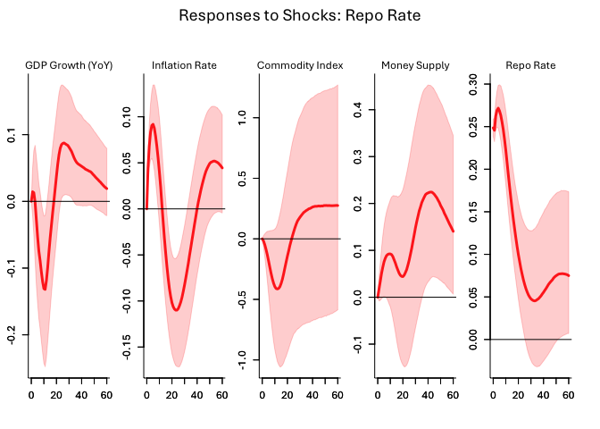

## Historical Decompositions

The historical variance decompositions are to memory intensive and thus
my document will not knit if I keep it in so instead I have saved the
images and source them.

``` r
date_vector <- seq.Date(from = as.Date(start_date1), by = "month", length.out = nrow(data_ts))

# process_hds(
#   model = post_custom,
#   data = data_ts,
#   custom_labels = custom_labels,
#   decomp_vars = voi,
#   date_vector = date_vector,
#   save_results = FALSE  # Optionally save the results
# )
```

## Forecast Error Variance Decompositions

``` r
process_fevds(
  model = post_custom,
  custom_labels = custom_labels,
  selected_variable = voi,
  save_results = FALSE
)
```

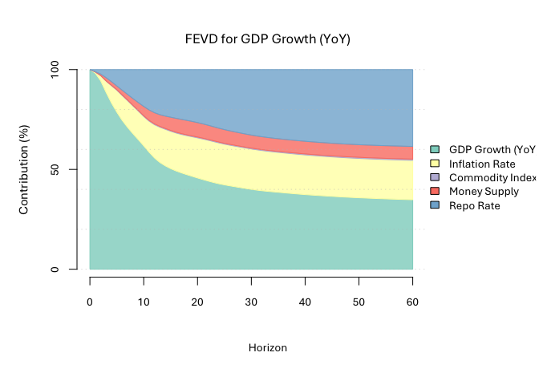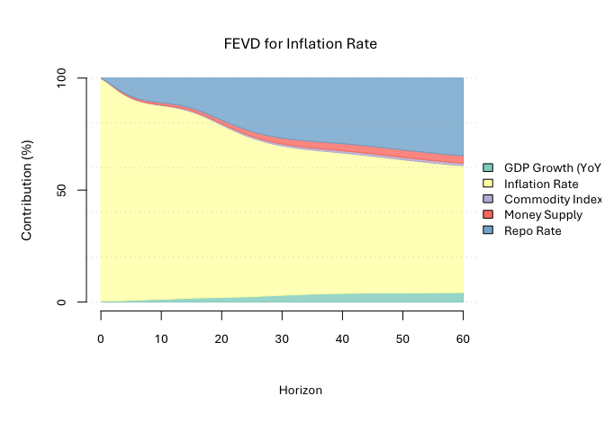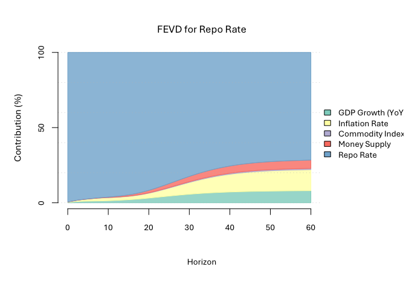

# Sign Restrictions

## Uhlig

We start with Uhlig’s sign restrictions first. I then add the additional
restrictions based on Arias et al (2018)

``` r
# Define the sign_structural matrix with 1 (unrestricted) and 0 (zero restrictions)
num_vars <- ncol(data_ts)
sign_structural <- matrix(NA, nrow = ncol(data_ts), ncol = ncol(data_ts))  # Initialize with zeros (restrictions)

# Restriction 1. The federal funds rate is the monetary policy instrument and it only reacts contemporaneously to output, prices, and commodity prices.

# Restriction 2. The contemporaneous reaction of the federal funds rate to output and prices is positive.

# Apply the unrestricted elements (set to 1) based on your matrix structure
# 
# sign_structural[1, 1 ] <- 1 
# sign_structural[1, 3 ] <- 1 
# sign_structural[2,1:3] <- 1 
# sign_structural[3,3] <- 1 
# 

# Sign restrictions on impulse responses (sign_irf)
# Important note, the location of the row does not matter. We are imposing a structure to the relationship between variables in the IRFs themselves.
sign_irf <- matrix(NA, nrow = num_vars, ncol = num_vars)

sign_irf[,5] <-c(NA, -1, -1, NA, 1)

sign_irf <- array(sign_irf, dim = c(5, 5, 6)) # Restriction on impulse for first 5 time periods


# specify identifying restrictions:
# + sign restrictions on the impulse responses at horizons from 0 to 5

# Specify and estimate the model
sign_spec <- specify_bsvarSIGN$new(
  data = data_ts,
  p = 12,
  sign_irf = sign_irf
)

model_sign_restricted <- estimate(sign_spec, S = 10000)
```

    ## **************************************************|
    ##  bsvarSIGNs: Bayesian Structural VAR with sign,   |
    ##              zero and narrative restrictions      |
    ## **************************************************|
    ##  Progress of simulation for 10000 independent draws
    ##  Press Esc to interrupt the computations
    ## **************************************************|

``` r
model <- model_sign_restricted

shock <- c( "bank_rate")

# Process IRFs
process_irfs(
  model = model,
  model_name = model_name,
  data = data_ts,
  custom_labels = custom_labels,
  shocks = shock,
  save_results = FALSE
)
```

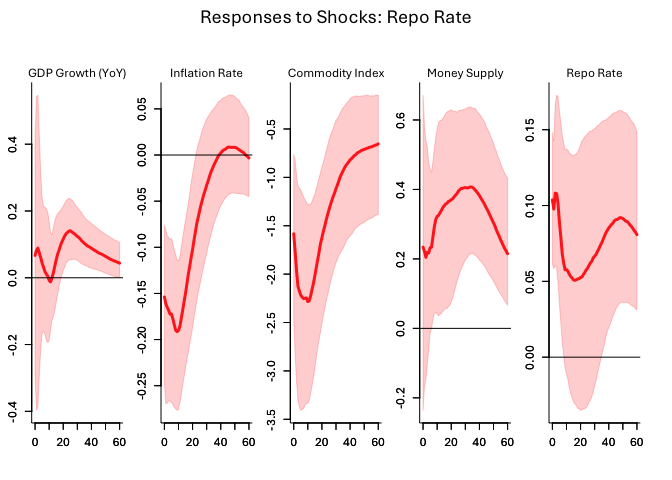 The
“boost” of output could be due to masquerading effects (wolf, 2022) \##
Narrative sign restrictions

``` r
# Define the sequence of monthly dates starting from the start date
date_check1 <- seq.Date(from = as.Date("2002-01-01"), by = "month", length.out = nrow(data_ts))

# Define the target date
target_date <- as.Date("2020-03-01")  # February 2020

# Find the index of the target date in the sequence
index <- which(date_check1 == target_date)

# Print the result
print(index)  # Should print 134
```

    ## [1] 219

``` r
# Narrative sign restriction: the shock is positive in Feb 2020
sign_narrative <- list(
    specify_narrative(start = index, periods = 1, type = "S", sign = -1, shock = 1),
  specify_narrative(start = index, periods = 1, type = "B", sign = -1, shock = 1, var = 5)
)

# Specify and estimate the model
narrative_spec <- specify_bsvarSIGN$new(
  data = data_ts,
  p = 12,
  sign_narrative = sign_narrative,
 sign_irf = sign_irf
)

model_narrative <- estimate(narrative_spec, S = 10000)
```

    ## **************************************************|
    ##  bsvarSIGNs: Bayesian Structural VAR with sign,   |
    ##              zero and narrative restrictions      |
    ## **************************************************|
    ##  Progress of simulation for 10000 independent draws
    ##  Press Esc to interrupt the computations
    ## **************************************************|

``` r
model <- model_narrative

# Define shock indices (can be indices or variable names)
# here I want tht VOI at this stage and as I add variables then this can change

# Process IRFs
process_irfs(
  model = model,
  model_name = model_name,
  data = data,
  custom_labels = custom_labels,
  shocks =shock,
  save_results = FALSE
)
```


The

``` r
shocks_estimated_narrative        = compute_structural_shocks(model_narrative)
shocks_estimated_basic = compute_structural_shocks(post_custom)


# Extract the shocks for the 5th variable at the 219th date
selected_shock1 <- shocks_estimated_narrative[5, 219, ]
selected_shock2 <- shocks_estimated_basic[5, 219, ]

# Find the maximum y value for the densities
max_density <- max(c(selected_shock1, selected_shock2))

# Set the ylim to range from 0 to the maximum density
ylim_range <- c(0, max_density * 1.1)  # Adding a 10% buffer for better visualization


# Set up the plot area
hist(selected_shock1, 
     main = "Comparison of Shocks for 5th Variable at 219th Date",
     xlab = "Shock Value",
     col = rgb(0.1, 0.2, 0.5, 0.5),  # Semi-transparent blue
     border = "black",
     freq = FALSE,  # Density plot
     xlim = range(c(selected_shock1, selected_shock2)),
     ylim = c(0,1))  # Set limits to fit both histograms

# Overlay the second histogram
hist(selected_shock2, 
     col = rgb(0.8, 0.3, 0.3, 0.5),  # Semi-transparent red
     border = "black",
     freq = FALSE,
     add = TRUE)  # Overlay on the first histogram

# Add density curves for both models
lines(density(selected_shock1), col = "blue", lwd = 2)
lines(density(selected_shock2), col = "red", lwd = 2)

# Add a legend
legend("topright", 
       legend = c("Narrative", "No Narrative"), 
       fill = c(rgb(0.1, 0.2, 0.5, 0.5), rgb(0.8, 0.3, 0.3, 0.5)),
       border = "black")
```

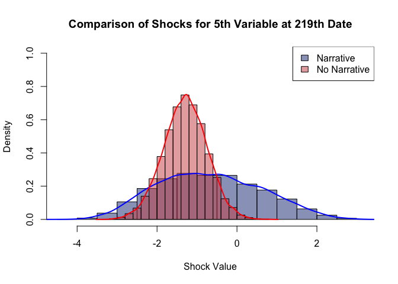

``` r
process_fevds(
  model = model_narrative,
  custom_labels = custom_labels,
  selected_variable = voi,
  save_results = FALSE
)
```

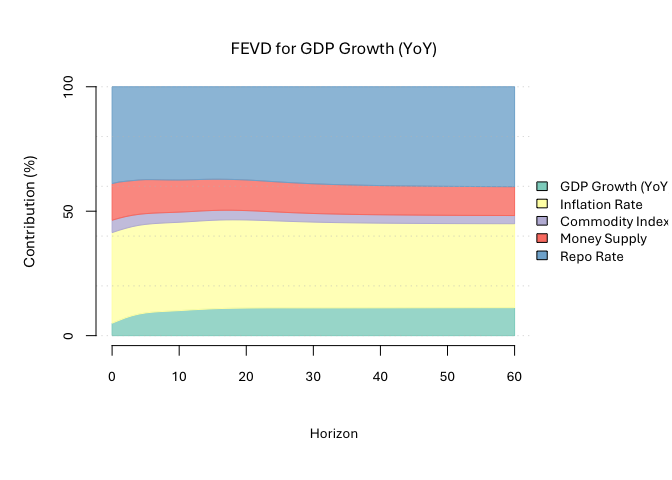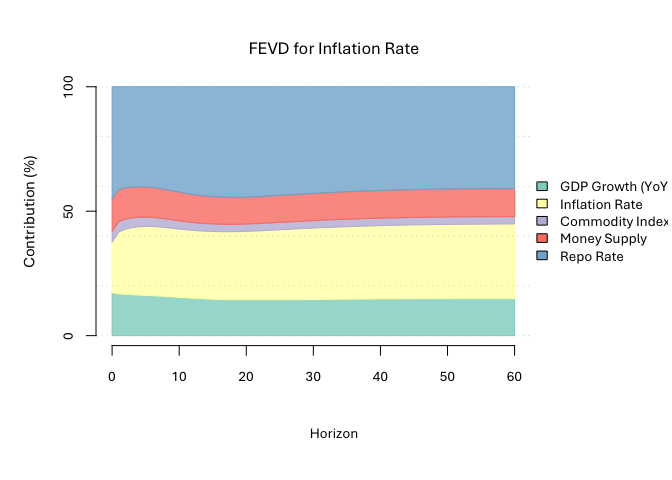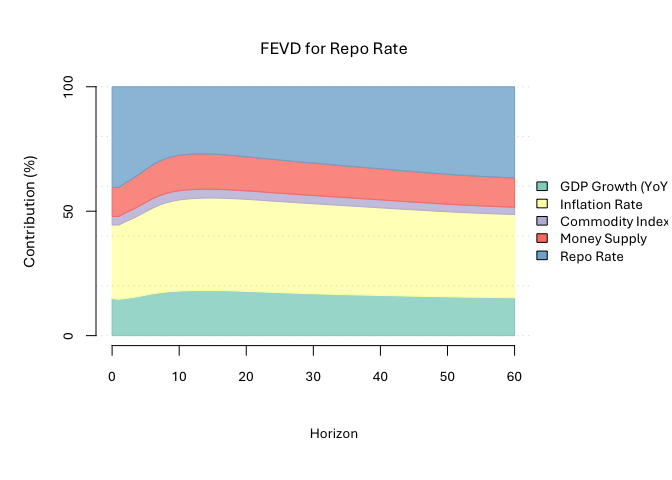

``` r
date_vector <- seq.Date(from = as.Date(start_date1), by = "month", length.out = nrow(data_ts))

# process_hds(
#   model = model_narrative,
#   data = data_ts,
#   custom_labels = custom_labels,
#   decomp_vars = voi,  # List of variables
#   date_vector = date_vector,
#   save_results = FALSE  # Optionally save the results
# )
```

# Post GFC sample

``` r
#Here we need to get the smaller sample from 2009-01-01
GFC_date <- as.Date("2009-01-01")  

index_gfc <- which(date_check1 == GFC_date)

# Print the result
print(index_gfc)  
```

    ## [1] 85

``` r
data_tbl_gfc <- as_tibble(model_data) %>% 
     dplyr::select( "gdp_yoy", "inflation","commodity", "M3",  "bank_rate") %>% 
    tail(-84)
    

data_mat_gfc <- as.matrix(data_tbl_gfc)


# Assuming start_date is in the format "YYYY-MM-DD"
start_year2 <- as.numeric(format(as.Date(GFC_date), "%Y"))
start_month2 <- as.numeric(format(as.Date(GFC_date), "%m"))

# Create the time series
data_ts_gfc <- ts(data_mat_gfc, start = c(start_year2, start_month2), frequency = 12)
```

``` r
plot_model_series(data_ts_gfc, custom_labels, plotting_params)
```

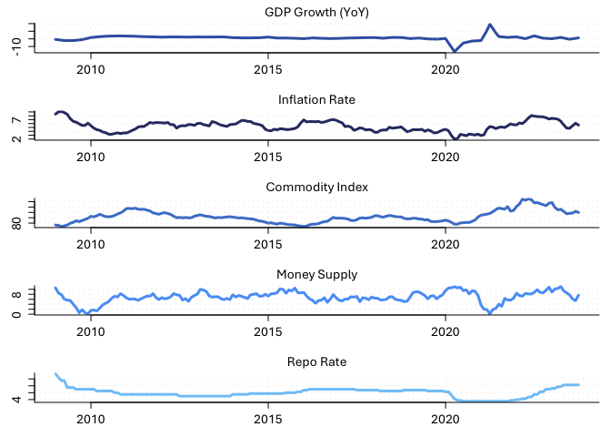

## Baseline Smaller sample

``` r
# Restrictions 
restrictions <- generate_restrictions(colnames(data_ts_gfc))

# Build the B matrix with restrictions
B <- build_B_matrix(colnames(data_ts), restrictions = NULL)

model_params <- list(S_burn = 1000, S = 10000, p = 12)

# Estimate the SVAR model
post_custom_gfc <- specify_and_estimate(
  data = data_ts_gfc,
  p = model_params$p,
  model_type = "basic",
  B = B,
  S_burn = model_params$S_burn,
  S = model_params$S
)
```

    ## **************************************************|
    ## bsvars: Bayesian Structural Vector Autoregressions|
    ## **************************************************|
    ##  Gibbs sampler for the SVAR model                 |
    ## **************************************************|
    ##  Progress of the MCMC simulation for 1000 draws
    ##     Every draw is saved via MCMC thinning
    ##  Press Esc to interrupt the computations
    ## **************************************************|
    ## **************************************************|
    ## bsvars: Bayesian Structural Vector Autoregressions|
    ## **************************************************|
    ##  Gibbs sampler for the SVAR model                 |
    ## **************************************************|
    ##  Progress of the MCMC simulation for 10000 draws
    ##     Every draw is saved via MCMC thinning
    ##  Press Esc to interrupt the computations
    ## **************************************************|

``` r
process_irfs(
  model = post_custom_gfc,
  data = data_ts_gfc,
  custom_labels = custom_labels,
  shocks = "bank_rate",
  save_results = FALSE
)
```

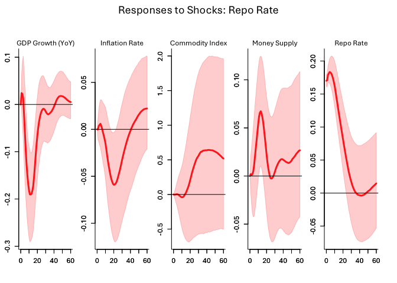

## Pure Sign restriction (Uhlig, 2005)

``` r
# Define the sign_structural matrix with 1 (unrestricted) and 0 (zero restrictions)
num_vars <- ncol(data_ts)
sign_structural <- matrix(NA, nrow = ncol(data_ts), ncol = ncol(data_ts))  # Initialize with zeros (restrictions)

# Restriction 1. The federal funds rate is the monetary policy instrument and it only reacts contemporaneously to output, prices, and commodity prices.

# Restriction 2. The contemporaneous reaction of the federal funds rate to output and prices is positive.

# Apply the unrestricted elements (set to 1) based on your matrix structure
# 
# sign_structural[1, 1 ] <- 1 
# sign_structural[1, 3 ] <- 1 
# sign_structural[2,1:3] <- 1 
# sign_structural[3,3] <- 1 
# 

# Sign restrictions on impulse responses (sign_irf)
# Important note, the location of the row does not matter. We are imposing a structure to the relationship between variables in the IRFs themselves.
sign_irf <- matrix(NA, nrow = num_vars, ncol = num_vars)

sign_irf[,5] <-c(NA, -1, -1, NA, 1)

sign_irf <- array(sign_irf, dim = c(5, 5, 6)) # Restriction on impulse for first 5 time periods


# specify identifying restrictions:
# + sign restrictions on the impulse responses at horizons from 0 to 5

# Specify and estimate the model
sign_spec <- specify_bsvarSIGN$new(
  data = data_ts_gfc,
  p = 12,
  sign_irf = sign_irf
)

model_sign_restricted_gfc <- estimate(sign_spec, S = 10000)
```

    ## **************************************************|
    ##  bsvarSIGNs: Bayesian Structural VAR with sign,   |
    ##              zero and narrative restrictions      |
    ## **************************************************|
    ##  Progress of simulation for 10000 independent draws
    ##  Press Esc to interrupt the computations
    ## **************************************************|

``` r
model_gfc <- model_sign_restricted_gfc

shock <- c( "bank_rate")

# Process IRFs
process_irfs(
  model = model_gfc,
  model_name = model_name,
  data = data_ts_gfc,
  custom_labels = custom_labels,
  shocks = shock,
  save_results = FALSE
)
```

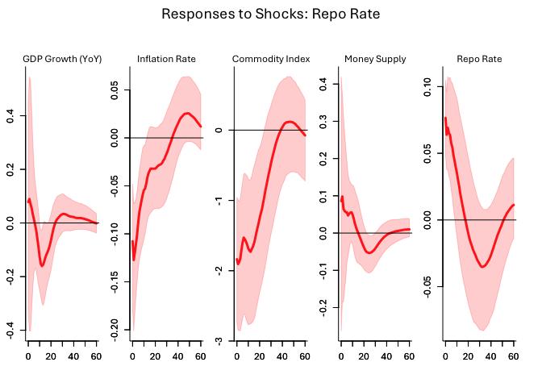 The
“boost” of output could be due to masquerading effects (wolf, 2022) \##
Narrative sign restrictions

``` r
# Define the sequence of monthly dates starting from the start date
date_check2 <- seq.Date(from = as.Date("2009-01-01"), by = "month", length.out = nrow(data_ts_gfc))

# Define the target date
target_date <- as.Date("2020-03-01")  # February 2020

# Find the index of the target date in the sequence
index <- which(date_check2 == target_date)

# Print the result
print(index)  
```

    ## [1] 135

``` r
# Narrative sign restriction: the shock is positive in Feb 2020
sign_narrative <- list(
    specify_narrative(start = index, periods = 2, type = "S", sign = -1, shock = 1),
  specify_narrative(start = index, periods = 2, type = "B", sign = -1, shock = 1, var = 5)
)

# Specify and estimate the model
narrative_spec <- specify_bsvarSIGN$new(
  data = data_ts,
  p = 12,
  sign_narrative = sign_narrative,
 sign_irf = sign_irf
)

model_narrative_gfc <- estimate(narrative_spec, S = 10000)
```

    ## **************************************************|
    ##  bsvarSIGNs: Bayesian Structural VAR with sign,   |
    ##              zero and narrative restrictions      |
    ## **************************************************|
    ##  Progress of simulation for 10000 independent draws
    ##  Press Esc to interrupt the computations
    ## **************************************************|

``` r
# Define shock indices (can be indices or variable names)
# here I want tht VOI at this stage and as I add variables then this can change

# Process IRFs
process_irfs(
  model = model_narrative_gfc,
  model_name = model_name,
  data = data_ts_gfc,
  custom_labels = custom_labels,
  shocks =shock,
  save_results = FALSE
)
```

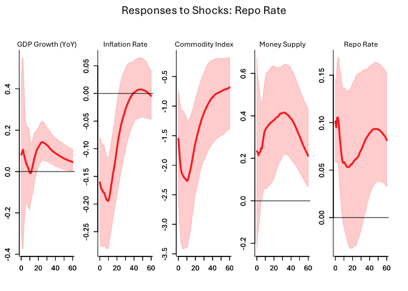

``` r
shocks_estimated_narrative_gfc        = compute_structural_shocks(model_narrative_gfc)
shocks_estimated_basic_gfc = compute_structural_shocks(post_custom_gfc)


# Extract the shocks for the 5th variable at the 219th date
selected_shock1_gfc <- shocks_estimated_narrative[5, 135, ]
selected_shock2_gfc <- shocks_estimated_basic[5, 135, ]


# Set up the plot area
hist(selected_shock1_gfc, 
     main = "Comparison of Shocks for",
     xlab = "Shock Value",
     col = rgb(0.1, 0.2, 0.5, 0.5),  # Semi-transparent blue
     border = "black",
     freq = FALSE,  # Density plot
     xlim = range(c(selected_shock1_gfc, selected_shock2_gfc)),
     ylim = c(0,2))  # Set limits to fit both histograms

# Overlay the second histogram
hist(selected_shock2_gfc, 
     col = rgb(0.8, 0.3, 0.3, 0.5),  # Semi-transparent red
     border = "black",
     freq = FALSE,
     add = TRUE)  # Overlay on the first histogram

# Add density curves for both models
lines(density(selected_shock1_gfc), col = "blue", lwd = 2)
lines(density(selected_shock2_gfc), col = "red", lwd = 2)

# Add a legend
legend("topright", 
       legend = c("Narrative", "No Narrative"), 
       fill = c(rgb(0.1, 0.2, 0.5, 0.5), rgb(0.8, 0.3, 0.3, 0.5)),
       border = "black")
```

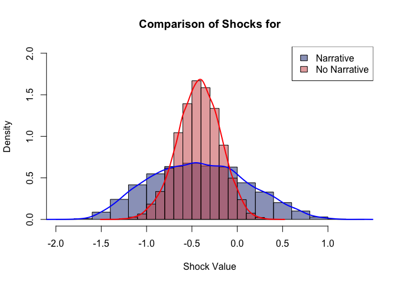

# Covid Dummy

``` r
# Total number of observations
# Total number of observations
n <- length(data_ts_gfc)

end_covid_date <- as.Date("2021-12-01")  

index_covid_end <- which(date_check1 == end_covid_date)

# Print the result
print(index_covid_end)  
```

    ## [1] 240

``` r
# Create a dummy variable with the correct length
dummy_variable <- as.matrix(c(rep(0, 134), rep(1, 156 - 134), rep(0, 178-156)))


data_ts_gfc_with_dummy <- cbind(data_ts_gfc, dummy_variable)

length(dummy_variable)
```

    ## [1] 178

``` r
# Specify and estimate the model
narrative_spec_dum <- specify_bsvarSIGN$new(
  data = data_ts_gfc,
  p = 12,
 sign_irf = sign_irf,
 exogenous = dummy_variable
)

model_narrative_gfc_dum <- estimate(narrative_spec_dum, S = 10000)
```

    ## **************************************************|
    ##  bsvarSIGNs: Bayesian Structural VAR with sign,   |
    ##              zero and narrative restrictions      |
    ## **************************************************|
    ##  Progress of simulation for 10000 independent draws
    ##  Press Esc to interrupt the computations
    ## **************************************************|

``` r
# Define shock indices (can be indices or variable names)
# here I want tht VOI at this stage and as I add variables then this can change

# Process IRFs
process_irfs(
  model = model_narrative_gfc_dum,
  model_name = model_name,
  data = data_ts_gfc,
  custom_labels = custom_labels,
  shocks =shock,
  save_results = FALSE
)
```

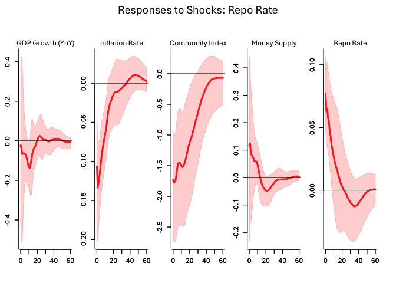

# Removal of Covid from the sample (2009 to 2019)

``` r
#Here we need to get the smaller sample from 2009-01-01- 2020-01-01
index_covid <- as.Date("2020-01-01")  

index_covid <- which(date_check2 == index_covid)

# Print the result
print(index_covid)  
```

    ## [1] 133

``` r
data_tbl_covid <- as_tibble(model_data) %>% 
     dplyr::select( "gdp_yoy", "inflation","commodity", "M3",  "bank_rate") %>% 
    tail(-84) %>% 
    head(-45)
    

data_mat_covid <- as.matrix(data_tbl_covid)


# Assuming start_date is in the format "YYYY-MM-DD"
start_year2 <- as.numeric(format(as.Date(GFC_date), "%Y"))
start_month2 <- as.numeric(format(as.Date(GFC_date), "%m"))

# Create the time series
data_ts_covid <- ts(data_mat_covid, start = c(start_year2, start_month2), frequency = 12)
```

``` r
# Restrictions 
restrictions <- generate_restrictions(colnames(data_ts_covid))

# Build the B matrix with restrictions
B <- build_B_matrix(colnames(data_ts_covid), restrictions = NULL)

model_params <- list(S_burn = 1000, S = 10000, p = 12)

# Estimate the SVAR model
post_custom_covid <- specify_and_estimate(
  data = data_ts_covid,
  p = model_params$p,
  model_type = "basic",
  B = B,
  S_burn = model_params$S_burn,
  S = model_params$S
)
```

    ## **************************************************|
    ## bsvars: Bayesian Structural Vector Autoregressions|
    ## **************************************************|
    ##  Gibbs sampler for the SVAR model                 |
    ## **************************************************|
    ##  Progress of the MCMC simulation for 1000 draws
    ##     Every draw is saved via MCMC thinning
    ##  Press Esc to interrupt the computations
    ## **************************************************|
    ## **************************************************|
    ## bsvars: Bayesian Structural Vector Autoregressions|
    ## **************************************************|
    ##  Gibbs sampler for the SVAR model                 |
    ## **************************************************|
    ##  Progress of the MCMC simulation for 10000 draws
    ##     Every draw is saved via MCMC thinning
    ##  Press Esc to interrupt the computations
    ## **************************************************|

``` r
process_irfs(
  model = post_custom_covid,
  data = data_ts_covid,
  custom_labels = custom_labels,
  shocks = "bank_rate",
  save_results = FALSE
)
```

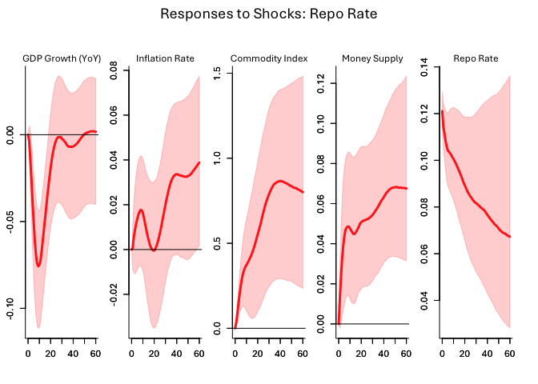

## Sign Restrictions

``` r
num_vars <- ncol(data_ts_covid)
sign_irf <- matrix(NA, nrow = num_vars, ncol = num_vars)

sign_irf[,5] <-c(NA, -1, -1, NA, 1)

sign_irf <- array(sign_irf, dim = c(5, 5, 6)) # Restriction on impulse for first 5 time periods


# specify identifying restrictions:
# + sign restrictions on the impulse responses at horizons from 0 to 5

# Specify and estimate the model
sign_spec <- specify_bsvarSIGN$new(
  data = data_ts_covid,
  p = 12,
  sign_irf = sign_irf
)

model_sign_restricted_covid <- estimate(sign_spec, S = 10000)
```

    ## **************************************************|
    ##  bsvarSIGNs: Bayesian Structural VAR with sign,   |
    ##              zero and narrative restrictions      |
    ## **************************************************|
    ##  Progress of simulation for 10000 independent draws
    ##  Press Esc to interrupt the computations
    ## **************************************************|

``` r
model <- model_sign_restricted_covid

shock <- c( "bank_rate")

# Process IRFs
process_irfs(
  model = model,
  model_name = model_name,
  data = data_ts_covid,
  custom_labels = custom_labels,
  shocks = shock,
  save_results = FALSE
)
```

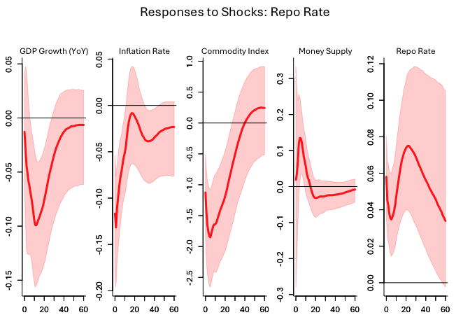
